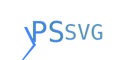

PowerShell tools for SVG.

PSSVG helps you create Scalable Vector Graphics using PowerShell.

There is a command for every tag of the SVG standard, complete with help and tab completion for every parameter.

For example, this script generates the image below it.

~~~PowerShell
=<svg> (
    =<svg.text> -Y 50 -Text "Hello World" -Fill "#4488FF"
) -ViewBox 0,0,200,100 -OutputPath .\HelloWorld.svg
~~~

PSSVG is designed to act as a fairly complete domain specific language:  every aspect of the SVG standard should be reflected in the commands of PSSVG.

The following elements are supported:

|Element                                               |Function                                              |Aliases                   |
|------------------------------------------------------|------------------------------------------------------|--------------------------|
|[a](docs/SVG.a.md)                                    |[SVG.a](SVG.a.ps1)                                    |=<svg.a>                  |
|[animate](docs/SVG.animate.md)                        |[SVG.animate](SVG.animate.ps1)                        |=<svg.animate>            |
|[animateMotion](docs/SVG.animateMotion.md)            |[SVG.animateMotion](SVG.animateMotion.ps1)            |=<svg.animateMotion>      |
|[animateTransform](docs/SVG.animateTransform.md)      |[SVG.animateTransform](SVG.animateTransform.ps1)      |=<svg.animateTransform>   |
|[circle](docs/SVG.circle.md)                          |[SVG.circle](SVG.circle.ps1)                          |=<svg.circle>             |
|[clipPath](docs/SVG.clipPath.md)                      |[SVG.clipPath](SVG.clipPath.ps1)                      |=<svg.clipPath>           |
|[defs](docs/SVG.defs.md)                              |[SVG.defs](SVG.defs.ps1)                              |=<svg.defs>               |
|[desc](docs/SVG.desc.md)                              |[SVG.desc](SVG.desc.ps1)                              |=<svg.desc>               |
|[discard](docs/SVG.discard.md)                        |[SVG.discard](SVG.discard.ps1)                        |=<svg.discard>            |
|[ellipse](docs/SVG.ellipse.md)                        |[SVG.ellipse](SVG.ellipse.ps1)                        |=<svg.ellipse>            |
|[feBlend](docs/SVG.feBlend.md)                        |[SVG.feBlend](SVG.feBlend.ps1)                        |=<svg.feBlend>            |
|[feColorMatrix](docs/SVG.feColorMatrix.md)            |[SVG.feColorMatrix](SVG.feColorMatrix.ps1)            |=<svg.feColorMatrix>      |
|[feComponentTransfer](docs/SVG.feComponentTransfer.md)|[SVG.feComponentTransfer](SVG.feComponentTransfer.ps1)|=<svg.feComponentTransfer>|
|[feComposite](docs/SVG.feComposite.md)                |[SVG.feComposite](SVG.feComposite.ps1)                |=<svg.feComposite>        |
|[feConvolveMatrix](docs/SVG.feConvolveMatrix.md)      |[SVG.feConvolveMatrix](SVG.feConvolveMatrix.ps1)      |=<svg.feConvolveMatrix>   |
|[feDiffuseLighting](docs/SVG.feDiffuseLighting.md)    |[SVG.feDiffuseLighting](SVG.feDiffuseLighting.ps1)    |=<svg.feDiffuseLighting>  |
|[feDisplacementMap](docs/SVG.feDisplacementMap.md)    |[SVG.feDisplacementMap](SVG.feDisplacementMap.ps1)    |=<svg.feDisplacementMap>  |
|[feDistantLight](docs/SVG.feDistantLight.md)          |[SVG.feDistantLight](SVG.feDistantLight.ps1)          |=<svg.feDistantLight>     |
|[feDropShadow](docs/SVG.feDropShadow.md)              |[SVG.feDropShadow](SVG.feDropShadow.ps1)              |=<svg.feDropShadow>       |
|[feFlood](docs/SVG.feFlood.md)                        |[SVG.feFlood](SVG.feFlood.ps1)                        |=<svg.feFlood>            |
|[feFuncA](docs/SVG.feFuncA.md)                        |[SVG.feFuncA](SVG.feFuncA.ps1)                        |=<svg.feFuncA>            |
|[feFuncB](docs/SVG.feFuncB.md)                        |[SVG.feFuncB](SVG.feFuncB.ps1)                        |=<svg.feFuncB>            |
|[feFuncG](docs/SVG.feFuncG.md)                        |[SVG.feFuncG](SVG.feFuncG.ps1)                        |=<svg.feFuncG>            |
|[feFuncR](docs/SVG.feFuncR.md)                        |[SVG.feFuncR](SVG.feFuncR.ps1)                        |=<svg.feFuncR>            |
|[feGaussianBlur](docs/SVG.feGaussianBlur.md)          |[SVG.feGaussianBlur](SVG.feGaussianBlur.ps1)          |=<svg.feGaussianBlur>     |
|[feImage](docs/SVG.feImage.md)                        |[SVG.feImage](SVG.feImage.ps1)                        |=<svg.feImage>            |
|[feMerge](docs/SVG.feMerge.md)                        |[SVG.feMerge](SVG.feMerge.ps1)                        |=<svg.feMerge>            |
|[feMergeNode](docs/SVG.feMergeNode.md)                |[SVG.feMergeNode](SVG.feMergeNode.ps1)                |=<svg.feMergeNode>        |
|[feMorphology](docs/SVG.feMorphology.md)              |[SVG.feMorphology](SVG.feMorphology.ps1)              |=<svg.feMorphology>       |
|[feOffset](docs/SVG.feOffset.md)                      |[SVG.feOffset](SVG.feOffset.ps1)                      |=<svg.feOffset>           |
|[fePointLight](docs/SVG.fePointLight.md)              |[SVG.fePointLight](SVG.fePointLight.ps1)              |=<svg.fePointLight>       |
|[feSpecularLighting](docs/SVG.feSpecularLighting.md)  |[SVG.feSpecularLighting](SVG.feSpecularLighting.ps1)  |=<svg.feSpecularLighting> |
|[feSpotLight](docs/SVG.feSpotLight.md)                |[SVG.feSpotLight](SVG.feSpotLight.ps1)                |=<svg.feSpotLight>        |
|[feTile](docs/SVG.feTile.md)                          |[SVG.feTile](SVG.feTile.ps1)                          |=<svg.feTile>             |
|[feTurbulence](docs/SVG.feTurbulence.md)              |[SVG.feTurbulence](SVG.feTurbulence.ps1)              |=<svg.feTurbulence>       |
|[filter](docs/SVG.filter.md)                          |[SVG.filter](SVG.filter.ps1)                          |=<svg.filter>             |
|[foreignObject](docs/SVG.foreignObject.md)            |[SVG.foreignObject](SVG.foreignObject.ps1)            |=<svg.foreignObject>      |
|[g](docs/SVG.g.md)                                    |[SVG.g](SVG.g.ps1)                                    |=<svg.g>                  |
|[image](docs/SVG.image.md)                            |[SVG.image](SVG.image.ps1)                            |=<svg.image>              |
|[line](docs/SVG.line.md)                              |[SVG.line](SVG.line.ps1)                              |=<svg.line>               |
|[linearGradient](docs/SVG.linearGradient.md)          |[SVG.linearGradient](SVG.linearGradient.ps1)          |=<svg.linearGradient>     |
|[marker](docs/SVG.marker.md)                          |[SVG.marker](SVG.marker.ps1)                          |=<svg.marker>             |
|[mask](docs/SVG.mask.md)                              |[SVG.mask](SVG.mask.ps1)                              |=<svg.mask>               |
|[metadata](docs/SVG.metadata.md)                      |[SVG.metadata](SVG.metadata.ps1)                      |=<svg.metadata>           |
|[mpath](docs/SVG.mpath.md)                            |[SVG.mpath](SVG.mpath.ps1)                            |=<svg.mpath>              |
|[path](docs/SVG.path.md)                              |[SVG.path](SVG.path.ps1)                              |=<svg.path>               |
|[pattern](docs/SVG.pattern.md)                        |[SVG.pattern](SVG.pattern.ps1)                        |=<svg.pattern>            |
|[polygon](docs/SVG.polygon.md)                        |[SVG.polygon](SVG.polygon.ps1)                        |=<svg.polygon>            |
|[polyline](docs/SVG.polyline.md)                      |[SVG.polyline](SVG.polyline.ps1)                      |=<svg.polyline>           |
|[radialGradient](docs/SVG.radialGradient.md)          |[SVG.radialGradient](SVG.radialGradient.ps1)          |=<svg.radialGradient>     |
|[rect](docs/SVG.rect.md)                              |[SVG.rect](SVG.rect.ps1)                              |=<svg.rect>               |
|[script](docs/SVG.script.md)                          |[SVG.script](SVG.script.ps1)                          |=<svg.script>             |
|[set](docs/SVG.set.md)                                |[SVG.set](SVG.set.ps1)                                |=<svg.set>                |
|[stop](docs/SVG.stop.md)                              |[SVG.stop](SVG.stop.ps1)                              |=<svg.stop>               |
|[style](docs/SVG.style.md)                            |[SVG.style](SVG.style.ps1)                            |=<svg.style>              |
|[svg](docs/SVG.svg.md)                                |[SVG.svg](SVG.svg.ps1)                                |=<svg> svg                |
|[switch](docs/SVG.switch.md)                          |[SVG.switch](SVG.switch.ps1)                          |=<svg.switch>             |
|[symbol](docs/SVG.symbol.md)                          |[SVG.symbol](SVG.symbol.ps1)                          |=<svg.symbol>             |
|[text](docs/SVG.text.md)                              |[SVG.text](SVG.text.ps1)                              |=<svg.text>               |
|[textPath](docs/SVG.textPath.md)                      |[SVG.textPath](SVG.textPath.ps1)                      |=<svg.textPath>           |
|[title](docs/SVG.title.md)                            |[SVG.title](SVG.title.ps1)                            |=<svg.title>              |
|[tspan](docs/SVG.tspan.md)                            |[SVG.tspan](SVG.tspan.ps1)                            |=<svg.tspan>              |
|[use](docs/SVG.use.md)                                |[SVG.use](SVG.use.ps1)                                |=<svg.use>                |
|[view](docs/SVG.view.md)                              |[SVG.view](SVG.view.ps1)                              |=<svg.view>               |

(elements marked deprecated are not supported)

## Goals

PSSVG hopes to be a useful toolkit for generating SVG images from PowerShell.

SVG has many benefits as an image file format, for example:
* File Size
* Scalability
* Animations
* Clickability
* HTML/JavaScript/CSS integration
* OS Integration

However, it is not a complete programming language.

Thus the primary goal is to make SVG creation scriptable.

### Limitations 

At current, PSSVG does not support event or aria attributes.

### How PSSVG is Built

In order to provide an ideal PowerShell experience with rich help,  
PSSVG is currently built by reading the contents of the [Mozilla Developer Network's content repository](https://github.com/mdn/content).

It uses two PowerShell modules to read the repository and create the commands:

* [Irregular](https://github.com/StartAutomating/Irregular) is used to help parse the markdown contents of the repository
* [PipeScript](https://github.com/StartAutomating/PipeScript) is used to create the functions from the parsed data.

