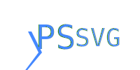

PowerShell tools for SVG.

PSSVG helps you create Scalable Vector Graphics using PowerShell.

There is a command for every tag of the SVG standard, complete with help and tab completion for every parameter.

For example, this script generates the image below it.

~~~PowerShell
=<svg> (
    =<svg.text> -Y 50 -Text "Hello World" -Fill "#4488FF"
) -ViewBox 0,0,200,100 -OutputPath .\HelloWorld.svg
~~~

PSSVG is designed to act as a fairly complete domain specific language:  every aspect of the SVG standard should be reflected in the commands of PSSVG.

The following elements are supported:

~~~PipeScript {
    Import-Module .\PSSVG.psd1 -Global
    [PSCustomObject]@{
        Table = Get-Command -Module PSSVG -Name SVG.* -CommandType Function |
            .Element {
                $cmd = $_
                $docLink = "docs/$($_.Name).md"
                $elementName = $_.ScriptBlock.Attributes | Where-Object Key -eq 'SVG.ElementName' | Select-Object -ExpandProperty Value
                "[$elementName]($docLink)"
            } .Function {
                "[$($_.Name)]($($_.Name).ps1)"
            } .Aliases {
                $cmd = $_
                $aliases = @(Get-Alias | Where-Object { $_.ResolvedCommand.Name -eq $cmd.Name } | Select-Object -ExpandProperty Name) -join ' '
                [Web.HttpUtility]::HTMLEncode($aliases)
            }            
    }
}
~~~

(elements marked deprecated are not supported)

## Goals

PSSVG hopes to be a useful toolkit for generating SVG images from PowerShell.

SVG has many benefits as an image file format, for example:
* File Size
* Scalability
* Animations
* Clickability
* HTML/JavaScript/CSS integration
* OS Integration

However, it is not a complete programming language.

Thus the primary goal is to make SVG creation scriptable.

### Limitations 

At current, PSSVG does not support event or aria attributes.

### How PSSVG is Built

In order to provide an ideal PowerShell experience with rich help,  
PSSVG is currently built by reading the contents of the [Mozilla Developer Network's content repository](https://github.com/mdn/content).

It uses two PowerShell modules to read the repository and create the commands:

* [Irregular](https://github.com/StartAutomating/Irregular) is used to help parse the markdown contents of the repository
* [PipeScript](https://github.com/StartAutomating/PipeScript) is used to create the functions from the parsed data.

