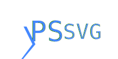

PowerShell tools for SVG.

PSSVG helps you create Scalable Vector Graphics using PowerShell.

There is a command for every tag of the SVG standard, complete with help and tab completion for every parameter.

For example, this script generates the image below it.

~~~PowerShell
=<svg> (
    =<svg.text> -Y 50 -Text "Hello World" -Fill "#4488FF"
) -ViewBox 0,0,200,100 -OutputPath .\HelloWorld.svg
~~~

PSSVG is designed to act as a fairly complete domain specific language:  every aspect of the SVG standard should be reflected in the commands of PSSVG.

The following elements are supported:

|Element                                               |Function                                              |Aliases                         |
|------------------------------------------------------|------------------------------------------------------|--------------------------------|
|[a](SVG.a.md)                                    |[SVG.a](SVG.a.ps1)                                    |=&lt;svg.a&gt;                  |
|[animate](SVG.animate.md)                        |[SVG.animate](SVG.animate.ps1)                        |=&lt;svg.animate&gt;            |
|[animateMotion](SVG.animateMotion.md)            |[SVG.animateMotion](SVG.animateMotion.ps1)            |=&lt;svg.animateMotion&gt;      |
|[animateTransform](SVG.animateTransform.md)      |[SVG.animateTransform](SVG.animateTransform.ps1)      |=&lt;svg.animateTransform&gt;   |
|[circle](SVG.circle.md)                          |[SVG.circle](SVG.circle.ps1)                          |=&lt;svg.circle&gt;             |
|[clipPath](SVG.clipPath.md)                      |[SVG.clipPath](SVG.clipPath.ps1)                      |=&lt;svg.clipPath&gt;           |
|[defs](SVG.defs.md)                              |[SVG.defs](SVG.defs.ps1)                              |=&lt;svg.defs&gt;               |
|[desc](SVG.desc.md)                              |[SVG.desc](SVG.desc.ps1)                              |=&lt;svg.desc&gt;               |
|[discard](SVG.discard.md)                        |[SVG.discard](SVG.discard.ps1)                        |=&lt;svg.discard&gt;            |
|[ellipse](SVG.ellipse.md)                        |[SVG.ellipse](SVG.ellipse.ps1)                        |=&lt;svg.ellipse&gt;            |
|[feBlend](SVG.feBlend.md)                        |[SVG.feBlend](SVG.feBlend.ps1)                        |=&lt;svg.feBlend&gt;            |
|[feColorMatrix](SVG.feColorMatrix.md)            |[SVG.feColorMatrix](SVG.feColorMatrix.ps1)            |=&lt;svg.feColorMatrix&gt;      |
|[feComponentTransfer](SVG.feComponentTransfer.md)|[SVG.feComponentTransfer](SVG.feComponentTransfer.ps1)|=&lt;svg.feComponentTransfer&gt;|
|[feComposite](SVG.feComposite.md)                |[SVG.feComposite](SVG.feComposite.ps1)                |=&lt;svg.feComposite&gt;        |
|[feConvolveMatrix](SVG.feConvolveMatrix.md)      |[SVG.feConvolveMatrix](SVG.feConvolveMatrix.ps1)      |=&lt;svg.feConvolveMatrix&gt;   |
|[feDiffuseLighting](SVG.feDiffuseLighting.md)    |[SVG.feDiffuseLighting](SVG.feDiffuseLighting.ps1)    |=&lt;svg.feDiffuseLighting&gt;  |
|[feDisplacementMap](SVG.feDisplacementMap.md)    |[SVG.feDisplacementMap](SVG.feDisplacementMap.ps1)    |=&lt;svg.feDisplacementMap&gt;  |
|[feDistantLight](SVG.feDistantLight.md)          |[SVG.feDistantLight](SVG.feDistantLight.ps1)          |=&lt;svg.feDistantLight&gt;     |
|[feDropShadow](SVG.feDropShadow.md)              |[SVG.feDropShadow](SVG.feDropShadow.ps1)              |=&lt;svg.feDropShadow&gt;       |
|[feFlood](SVG.feFlood.md)                        |[SVG.feFlood](SVG.feFlood.ps1)                        |=&lt;svg.feFlood&gt;            |
|[feFuncA](SVG.feFuncA.md)                        |[SVG.feFuncA](SVG.feFuncA.ps1)                        |=&lt;svg.feFuncA&gt;            |
|[feFuncB](SVG.feFuncB.md)                        |[SVG.feFuncB](SVG.feFuncB.ps1)                        |=&lt;svg.feFuncB&gt;            |
|[feFuncG](SVG.feFuncG.md)                        |[SVG.feFuncG](SVG.feFuncG.ps1)                        |=&lt;svg.feFuncG&gt;            |
|[feFuncR](SVG.feFuncR.md)                        |[SVG.feFuncR](SVG.feFuncR.ps1)                        |=&lt;svg.feFuncR&gt;            |
|[feGaussianBlur](SVG.feGaussianBlur.md)          |[SVG.feGaussianBlur](SVG.feGaussianBlur.ps1)          |=&lt;svg.feGaussianBlur&gt;     |
|[feImage](SVG.feImage.md)                        |[SVG.feImage](SVG.feImage.ps1)                        |=&lt;svg.feImage&gt;            |
|[feMerge](SVG.feMerge.md)                        |[SVG.feMerge](SVG.feMerge.ps1)                        |=&lt;svg.feMerge&gt;            |
|[feMergeNode](SVG.feMergeNode.md)                |[SVG.feMergeNode](SVG.feMergeNode.ps1)                |=&lt;svg.feMergeNode&gt;        |
|[feMorphology](SVG.feMorphology.md)              |[SVG.feMorphology](SVG.feMorphology.ps1)              |=&lt;svg.feMorphology&gt;       |
|[feOffset](SVG.feOffset.md)                      |[SVG.feOffset](SVG.feOffset.ps1)                      |=&lt;svg.feOffset&gt;           |
|[fePointLight](SVG.fePointLight.md)              |[SVG.fePointLight](SVG.fePointLight.ps1)              |=&lt;svg.fePointLight&gt;       |
|[feSpecularLighting](SVG.feSpecularLighting.md)  |[SVG.feSpecularLighting](SVG.feSpecularLighting.ps1)  |=&lt;svg.feSpecularLighting&gt; |
|[feSpotLight](SVG.feSpotLight.md)                |[SVG.feSpotLight](SVG.feSpotLight.ps1)                |=&lt;svg.feSpotLight&gt;        |
|[feTile](SVG.feTile.md)                          |[SVG.feTile](SVG.feTile.ps1)                          |=&lt;svg.feTile&gt;             |
|[feTurbulence](SVG.feTurbulence.md)              |[SVG.feTurbulence](SVG.feTurbulence.ps1)              |=&lt;svg.feTurbulence&gt;       |
|[filter](SVG.filter.md)                          |[SVG.filter](SVG.filter.ps1)                          |=&lt;svg.filter&gt;             |
|[foreignObject](SVG.foreignObject.md)            |[SVG.foreignObject](SVG.foreignObject.ps1)            |=&lt;svg.foreignObject&gt;      |
|[g](SVG.g.md)                                    |[SVG.g](SVG.g.ps1)                                    |=&lt;svg.g&gt;                  |
|[image](SVG.image.md)                            |[SVG.image](SVG.image.ps1)                            |=&lt;svg.image&gt;              |
|[line](SVG.line.md)                              |[SVG.line](SVG.line.ps1)                              |=&lt;svg.line&gt;               |
|[linearGradient](SVG.linearGradient.md)          |[SVG.linearGradient](SVG.linearGradient.ps1)          |=&lt;svg.linearGradient&gt;     |
|[marker](SVG.marker.md)                          |[SVG.marker](SVG.marker.ps1)                          |=&lt;svg.marker&gt;             |
|[mask](SVG.mask.md)                              |[SVG.mask](SVG.mask.ps1)                              |=&lt;svg.mask&gt;               |
|[metadata](SVG.metadata.md)                      |[SVG.metadata](SVG.metadata.ps1)                      |=&lt;svg.metadata&gt;           |
|[mpath](SVG.mpath.md)                            |[SVG.mpath](SVG.mpath.ps1)                            |=&lt;svg.mpath&gt;              |
|[path](SVG.path.md)                              |[SVG.path](SVG.path.ps1)                              |=&lt;svg.path&gt;               |
|[pattern](SVG.pattern.md)                        |[SVG.pattern](SVG.pattern.ps1)                        |=&lt;svg.pattern&gt;            |
|[polygon](SVG.polygon.md)                        |[SVG.polygon](SVG.polygon.ps1)                        |=&lt;svg.polygon&gt;            |
|[polyline](SVG.polyline.md)                      |[SVG.polyline](SVG.polyline.ps1)                      |=&lt;svg.polyline&gt;           |
|[radialGradient](SVG.radialGradient.md)          |[SVG.radialGradient](SVG.radialGradient.ps1)          |=&lt;svg.radialGradient&gt;     |
|[rect](SVG.rect.md)                              |[SVG.rect](SVG.rect.ps1)                              |=&lt;svg.rect&gt;               |
|[script](SVG.script.md)                          |[SVG.script](SVG.script.ps1)                          |=&lt;svg.script&gt;             |
|[set](SVG.set.md)                                |[SVG.set](SVG.set.ps1)                                |=&lt;svg.set&gt;                |
|[stop](SVG.stop.md)                              |[SVG.stop](SVG.stop.ps1)                              |=&lt;svg.stop&gt;               |
|[style](SVG.style.md)                            |[SVG.style](SVG.style.ps1)                            |=&lt;svg.style&gt;              |
|[svg](SVG.svg.md)                                |[SVG.svg](SVG.svg.ps1)                                |=&lt;svg&gt; svg                |
|[switch](SVG.switch.md)                          |[SVG.switch](SVG.switch.ps1)                          |=&lt;svg.switch&gt;             |
|[symbol](SVG.symbol.md)                          |[SVG.symbol](SVG.symbol.ps1)                          |=&lt;svg.symbol&gt;             |
|[text](SVG.text.md)                              |[SVG.text](SVG.text.ps1)                              |=&lt;svg.text&gt;               |
|[textPath](SVG.textPath.md)                      |[SVG.textPath](SVG.textPath.ps1)                      |=&lt;svg.textPath&gt;           |
|[title](SVG.title.md)                            |[SVG.title](SVG.title.ps1)                            |=&lt;svg.title&gt;              |
|[tspan](SVG.tspan.md)                            |[SVG.tspan](SVG.tspan.ps1)                            |=&lt;svg.tspan&gt;              |
|[use](SVG.use.md)                                |[SVG.use](SVG.use.ps1)                                |=&lt;svg.use&gt;                |
|[view](SVG.view.md)                              |[SVG.view](SVG.view.ps1)                              |=&lt;svg.view&gt;               |

(elements marked deprecated are not supported)

## Goals

PSSVG hopes to be a useful toolkit for generating SVG images from PowerShell.

SVG has many benefits as an image file format, for example:
* File Size
* Scalability
* Animations
* Clickability
* HTML/JavaScript/CSS integration
* OS Integration

However, it is not a complete programming language.

Thus the primary goal is to make SVG creation scriptable.

### Limitations 

At current, PSSVG does not support event or aria attributes.

### How PSSVG is Built

In order to provide an ideal PowerShell experience with rich help,  
PSSVG is currently built by reading the contents of the [Mozilla Developer Network's content repository](https://github.com/mdn/content).

It uses two PowerShell modules to read the repository and create the commands:

* [Irregular](https://github.com/StartAutomating/Irregular) is used to help parse the markdown contents of the repository
* [PipeScript](https://github.com/StartAutomating/PipeScript) is used to create the functions from the parsed data.

