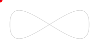
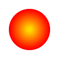
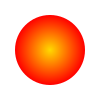

PowerShell tools for SVG.

PSSVG helps you create Scalable Vector Graphics using PowerShell.

There is a command for every tag of the SVG standard, complete with help and tab completion for every parameter.

For example, this script generates the image below it.

~~~PowerShell
=<svg> (
    =<svg.text> -X 50% -Y 50% -Fontsize 36 "Hello World" -DominantBaseline middle -TextAnchor middle -Fill '#4488ff'
) -ViewBox 0,0, 200, 100
~~~

PSSVG has _a lot cooler_ [Examples](https://github.com/StartAutomating/PSSVG/tree/main/Examples) than hello world:

|Example Name                                                                                                          |Image                                                                                                                                                                                                                                                                                                                                                                                                                                                                                                                                                                                                                                                                    |
|----------------------------------------------------------------------------------------------------------------------|-------------------------------------------------------------------------------------------------------------------------------------------------------------------------------------------------------------------------------------------------------------------------------------------------------------------------------------------------------------------------------------------------------------------------------------------------------------------------------------------------------------------------------------------------------------------------------------------------------------------------------------------------------------------------|
|[Animate](https://github.com/StartAutomating/PSSVG/tree/main/Examples/Animate.PSSVG.ps1)                              |[Animate.svg](Examples/Animate.svg)                                                                                                                                                                                                                                                                                                                                                                                                                                                                                                                                                                                                  |
|[AnimateColor](https://github.com/StartAutomating/PSSVG/tree/main/Examples/AnimateColor.PSSVG.ps1)                    |[AnimateColor.svg](Examples/AnimateColor.svg)                                                                                                                                                                                                                                                                                                                                                                                                                                                                                                                                                                              |
|[AnimatedShapes](https://github.com/StartAutomating/PSSVG/tree/main/Examples/AnimatedShapes.PSSVG.ps1)                |[AnimatedShapes.svg](Examples/AnimatedShapes.svg)                                                                                                                                                                                                                                                                                                                                                                                                                                                                                                                                                                      |
|[AnimateMotion](https://github.com/StartAutomating/PSSVG/tree/main/Examples/AnimateMotion.PSSVG.ps1)                  |[AnimateMotion.svg](Examples/AnimateMotion.svg)                                                                                                                                                                                                                                                                                                                                                                                                                                                                                                                                                                          |
|[Blur](https://github.com/StartAutomating/PSSVG/tree/main/Examples/Blur.PSSVG.ps1)                                    |[Blur.svg](Examples/Blur.svg)                                                                                                                                                                                                                                                                                                                                                                                                                                                                                                                                                                                                              |
|[BPMAnimate](https://github.com/StartAutomating/PSSVG/tree/main/Examples/BPMAnimate.PSSVG.ps1)                        |[BPMAnimate.svg](Examples/BPMAnimate.svg)                                                                                                                                                                                                                                                                                                                                                                                                                                                                                                                                                                                      |
|[BPMMorph](https://github.com/StartAutomating/PSSVG/tree/main/Examples/BPMMorph.PSSVG.ps1)                            |[BPMMorph.svg](Examples/BPMMorph.svg)                                                                                                                                                                                                                                                                                                                                                                                                                                                                                                                                                                                              |
|[Circles](https://github.com/StartAutomating/PSSVG/tree/main/Examples/Circles.PSSVG.ps1)                              |[Circles.svg](Examples/Circles.svg)                                                                                                                                                                                                                                                                                                                                                                                                                                                                                                                                                                                                  |
|[CloudAnimation](https://github.com/StartAutomating/PSSVG/tree/main/Examples/CloudAnimation.PSSVG.ps1)                |[CloudAnimation.svg](Examples/CloudAnimation.svg)                                                                                                                                                                                                                                                                                                                                                                                                                                                                                                                                                                      |
|[Clouds](https://github.com/StartAutomating/PSSVG/tree/main/Examples/Clouds.PSSVG.ps1)                                |[Clouds.svg](Examples/Clouds.svg)                                                                                                                                                                                                                                                                                                                                                                                                                                                                                                                                                                                                      |
|[DropShadow](https://github.com/StartAutomating/PSSVG/tree/main/Examples/DropShadow.PSSVG.ps1)                        |[DropShadow.svg](Examples/DropShadow.svg)                                                                                                                                                                                                                                                                                                                                                                                                                                                                                                                                                                                      |
|[Embossed](https://github.com/StartAutomating/PSSVG/tree/main/Examples/Embossed.PSSVG.ps1)                            |[Embossed.svg](Examples/Embossed.svg)                                                                                                                                                                                                                                                                                                                                                                                                                                                                                                                                                                                              |
|[FadeIn](https://github.com/StartAutomating/PSSVG/tree/main/Examples/FadeIn.PSSVG.ps1)                                |[FadeIn.svg](Examples/FadeIn.svg)                                                                                                                                                                                                                                                                                                                                                                                                                                                                                                                                                                                                      |
|[HelloWorld](https://github.com/StartAutomating/PSSVG/tree/main/Examples/HelloWorld.PSSVG.ps1)                        |[HelloWorld.svg](Examples/HelloWorld.svg)                                                                                                                                                                                                                                                                                                                                                                                                                                                                                                                                                                                      |
|[Index](https://github.com/StartAutomating/PSSVG/tree/main/Examples/Index.PSSVG.ps1)                                  |[Index.svg](Examples/Index.svg)                                                                                                                                                                                                                                                                                                                                                                                                                                                                                                                                                                                                          |
|[LinearGradient](https://github.com/StartAutomating/PSSVG/tree/main/Examples/LinearGradient.PSSVG.ps1)                |[LinearGradient.svg](Examples/LinearGradient.svg)                                                                                                                                                                                                                                                                                                                                                                                                                                                                                                                                                                      |
|[LinearGradientAnimated](https://github.com/StartAutomating/PSSVG/tree/main/Examples/LinearGradientAnimated.PSSVG.ps1)|[LinearGradientAnimated.svg](Examples/LinearGradientAnimated.svg)                                                                                                                                                                                                                                                                                                                                                                                                                                                                                                                                      |
|[ManyAnimatedRectangles](https://github.com/StartAutomating/PSSVG/tree/main/Examples/ManyAnimatedRectangles.PSSVG.ps1)|[ManyAnimatedRectangles.svg](Examples/ManyAnimatedRectangles.svg)                                                                                                                                                                                                                                                                                                                                                                                                                                                                                                                                      |
|[ManyRectangles](https://github.com/StartAutomating/PSSVG/tree/main/Examples/ManyRectangles.PSSVG.ps1)                |[ManyRectangles.svg](Examples/ManyRectangles.svg)                                                                                                                                                                                                                                                                                                                                                                                                                                                                                                                                                                      |
|[Morphing](https://github.com/StartAutomating/PSSVG/tree/main/Examples/Morphing.PSSVG.ps1)                            |[Morphing.svg](Examples/Morphing.svg)                                                                                                                                                                                                                                                                                                                                                                                                                                                                                                                                                                                              |
|[MovingGradient](https://github.com/StartAutomating/PSSVG/tree/main/Examples/MovingGradient.PSSVG.ps1)                |[MovingGradient.svg](Examples/MovingGradient.svg)                                                                                                                                                                                                                                                                                                                                                                                                                                                                                                                                                                      |
|[MovingShadows](https://github.com/StartAutomating/PSSVG/tree/main/Examples/MovingShadows.PSSVG.ps1)                  |
|[Pattern](https://github.com/StartAutomating/PSSVG/tree/main/Examples/Pattern.PSSVG.ps1)                              |[Pattern.svg](Examples/Pattern.svg)                                                                                                                                                                                                                                                                                                                                                                                                                                                                                                                                                                                                  |
|[PatternAnimation](https://github.com/StartAutomating/PSSVG/tree/main/Examples/PatternAnimation.PSSVG.ps1)            |[PatternAnimation.svg](Examples/PatternAnimation.svg)                                                                                                                                                                                                                                                                                                                                                                                                                                                                                                                                                              |
|[PatternMask](https://github.com/StartAutomating/PSSVG/tree/main/Examples/PatternMask.PSSVG.ps1)                      |[PatternMask.svg](Examples/PatternMask.svg)                                                                                                                                                                                                                                                                                                                                                                                                                                                                                                                                                                                  |
|[PowerShellChevron](https://github.com/StartAutomating/PSSVG/tree/main/Examples/PowerShellChevron.PSSVG.ps1)          |[PowerShellChevron.svg](Examples/PowerShellChevron.svg)                                                                                                                                                                                                                                                                                                                                                                                                                                                                                                                                                          |
|[RadialGradient](https://github.com/StartAutomating/PSSVG/tree/main/Examples/RadialGradient.PSSVG.ps1)                |[RadialGradient.svg](Examples/RadialGradient.svg)                                                                                                                                                                                                                                                                                                                                                                                                                                                                                                                                                                      |
|[RadialGradientAnimated](https://github.com/StartAutomating/PSSVG/tree/main/Examples/RadialGradientAnimated.PSSVG.ps1)|[RadialGradientAnimated.svg](Examples/RadialGradientAnimated.svg)                                                                                                                                                                                                                                                                                                                                                                                                                                                                                                                                      |
|[Shapes](https://github.com/StartAutomating/PSSVG/tree/main/Examples/Shapes.PSSVG.ps1)                                |[Shapes.svg](Examples/Shapes.svg)                                                                                                                                                                                                                                                                                                                                                                                                                                                                                                                                                                                                      |
|[SpinningSpiral](https://github.com/StartAutomating/PSSVG/tree/main/Examples/SpinningSpiral.PSSVG.ps1)                |[SpinningSpiral15.svg](Examples/SpinningSpiral15.svg)  [SpinningSpiral636.svg](Examples/SpinningSpiral636.svg)  [SpinningSpiral741.svg](Examples/SpinningSpiral741.svg)  [SpinningSpiral901.svg](Examples/SpinningSpiral901.svg)                                                                                                                                                                                                          |
|[StarRating](https://github.com/StartAutomating/PSSVG/tree/main/Examples/StarRating.PSSVG.ps1)                        |[StarRating.svg](Examples/StarRating.svg)                                                                                                                                                                                                                                                                                                                                                                                                                                                                                                                                                                                      |
|[Stars](https://github.com/StartAutomating/PSSVG/tree/main/Examples/Stars.PSSVG.ps1)                                  |[Stars.svg](Examples/Stars.svg)  [Stars10.svg](Examples/Stars10.svg)  [Stars11.svg](Examples/Stars11.svg)  [Stars12.svg](Examples/Stars12.svg)  [Stars5.svg](Examples/Stars5.svg)  [Stars6.svg](Examples/Stars6.svg)  [Stars7.svg](Examples/Stars7.svg)  [Stars8.svg](Examples/Stars8.svg)  [Stars9.svg](Examples/Stars9.svg) |
|[StopUsingGIFs](https://github.com/StartAutomating/PSSVG/tree/main/Examples/StopUsingGIFs.PSSVG.ps1)                  |[StopUsingGIFs.svg](Examples/StopUsingGIFs.svg)                                                                                                                                                                                                                                                                                                                                                                                                                                                                                                                                                                          |
|[SweepCircle](https://github.com/StartAutomating/PSSVG/tree/main/Examples/SweepCircle.PSSVG.ps1)                      |[SweepCircle.svg](Examples/SweepCircle.svg)                                                                                                                                                                                                                                                                                                                                                                                                                                                                                                                                                                                  |
|[VerticalLinearGradient](https://github.com/StartAutomating/PSSVG/tree/main/Examples/VerticalLinearGradient.PSSVG.ps1)|[VerticalLinearGradient.svg](Examples/VerticalLinearGradient.svg)                                                                                                                                                                                                                                                                                                                                                                                                                                                                                                                                      |

PSSVG is designed to act as a fairly complete domain specific language:  every aspect of the SVG standard should be reflected in the commands of PSSVG.

The following commands are supported:

|Element                                               |Function                                                                                                                 |Aliases                         |
|------------------------------------------------------|-------------------------------------------------------------------------------------------------------------------------|--------------------------------|
|[a](SVG.a.md)                                    |[SVG.a](https://github.com/StartAutomating/PSSVG/tree/main/CommandsStandardSVG.a.ps1)                                    |=&lt;svg.a&gt;                  |
|[animate](SVG.animate.md)                        |[SVG.animate](https://github.com/StartAutomating/PSSVG/tree/main/CommandsStandardSVG.animate.ps1)                        |=&lt;svg.animate&gt;            |
|[animateMotion](SVG.animateMotion.md)            |[SVG.animateMotion](https://github.com/StartAutomating/PSSVG/tree/main/CommandsStandardSVG.animateMotion.ps1)            |=&lt;svg.animateMotion&gt;      |
|[animateTransform](SVG.animateTransform.md)      |[SVG.animateTransform](https://github.com/StartAutomating/PSSVG/tree/main/CommandsStandardSVG.animateTransform.ps1)      |=&lt;svg.animateTransform&gt;   |
|[Arc](SVG.Arc.md)                                |[SVG.Arc](https://github.com/StartAutomating/PSSVG/tree/main/CommandsCustomSVG.Arc.ps1)                                  |=&lt;svg.Arc&gt;                |
|[circle](SVG.circle.md)                          |[SVG.circle](https://github.com/StartAutomating/PSSVG/tree/main/CommandsStandardSVG.circle.ps1)                          |=&lt;svg.circle&gt;             |
|[clipPath](SVG.clipPath.md)                      |[SVG.clipPath](https://github.com/StartAutomating/PSSVG/tree/main/CommandsStandardSVG.clipPath.ps1)                      |=&lt;svg.clipPath&gt;           |
|[ConvexPolygon](SVG.ConvexPolygon.md)            |[SVG.ConvexPolygon](https://github.com/StartAutomating/PSSVG/tree/main/CommandsCustomSVG.ConvexPolygon.ps1)              |=&lt;svg.ConvexPolygon&gt;      |
|[defs](SVG.defs.md)                              |[SVG.defs](https://github.com/StartAutomating/PSSVG/tree/main/CommandsStandardSVG.defs.ps1)                              |=&lt;svg.defs&gt;               |
|[desc](SVG.desc.md)                              |[SVG.desc](https://github.com/StartAutomating/PSSVG/tree/main/CommandsStandardSVG.desc.ps1)                              |=&lt;svg.desc&gt;               |
|[discard](SVG.discard.md)                        |[SVG.discard](https://github.com/StartAutomating/PSSVG/tree/main/CommandsStandardSVG.discard.ps1)                        |=&lt;svg.discard&gt;            |
|[DropShadow](SVG.DropShadow.md)                  |[SVG.DropShadow](https://github.com/StartAutomating/PSSVG/tree/main/CommandsCustomSVG.DropShadow.ps1)                    |=&lt;svg.DropShadow&gt;         |
|[ellipse](SVG.ellipse.md)                        |[SVG.ellipse](https://github.com/StartAutomating/PSSVG/tree/main/CommandsStandardSVG.ellipse.ps1)                        |=&lt;svg.ellipse&gt;            |
|[feBlend](SVG.feBlend.md)                        |[SVG.feBlend](https://github.com/StartAutomating/PSSVG/tree/main/CommandsStandardSVG.feBlend.ps1)                        |=&lt;svg.feBlend&gt;            |
|[feColorMatrix](SVG.feColorMatrix.md)            |[SVG.feColorMatrix](https://github.com/StartAutomating/PSSVG/tree/main/CommandsStandardSVG.feColorMatrix.ps1)            |=&lt;svg.feColorMatrix&gt;      |
|[feComponentTransfer](SVG.feComponentTransfer.md)|[SVG.feComponentTransfer](https://github.com/StartAutomating/PSSVG/tree/main/CommandsStandardSVG.feComponentTransfer.ps1)|=&lt;svg.feComponentTransfer&gt;|
|[feComposite](SVG.feComposite.md)                |[SVG.feComposite](https://github.com/StartAutomating/PSSVG/tree/main/CommandsStandardSVG.feComposite.ps1)                |=&lt;svg.feComposite&gt;        |
|[feConvolveMatrix](SVG.feConvolveMatrix.md)      |[SVG.feConvolveMatrix](https://github.com/StartAutomating/PSSVG/tree/main/CommandsStandardSVG.feConvolveMatrix.ps1)      |=&lt;svg.feConvolveMatrix&gt;   |
|[feDiffuseLighting](SVG.feDiffuseLighting.md)    |[SVG.feDiffuseLighting](https://github.com/StartAutomating/PSSVG/tree/main/CommandsStandardSVG.feDiffuseLighting.ps1)    |=&lt;svg.feDiffuseLighting&gt;  |
|[feDisplacementMap](SVG.feDisplacementMap.md)    |[SVG.feDisplacementMap](https://github.com/StartAutomating/PSSVG/tree/main/CommandsStandardSVG.feDisplacementMap.ps1)    |=&lt;svg.feDisplacementMap&gt;  |
|[feDistantLight](SVG.feDistantLight.md)          |[SVG.feDistantLight](https://github.com/StartAutomating/PSSVG/tree/main/CommandsStandardSVG.feDistantLight.ps1)          |=&lt;svg.feDistantLight&gt;     |
|[feDropShadow](SVG.feDropShadow.md)              |[SVG.feDropShadow](https://github.com/StartAutomating/PSSVG/tree/main/CommandsStandardSVG.feDropShadow.ps1)              |=&lt;svg.feDropShadow&gt;       |
|[feFlood](SVG.feFlood.md)                        |[SVG.feFlood](https://github.com/StartAutomating/PSSVG/tree/main/CommandsStandardSVG.feFlood.ps1)                        |=&lt;svg.feFlood&gt;            |
|[feFuncA](SVG.feFuncA.md)                        |[SVG.feFuncA](https://github.com/StartAutomating/PSSVG/tree/main/CommandsStandardSVG.feFuncA.ps1)                        |=&lt;svg.feFuncA&gt;            |
|[feFuncB](SVG.feFuncB.md)                        |[SVG.feFuncB](https://github.com/StartAutomating/PSSVG/tree/main/CommandsStandardSVG.feFuncB.ps1)                        |=&lt;svg.feFuncB&gt;            |
|[feFuncG](SVG.feFuncG.md)                        |[SVG.feFuncG](https://github.com/StartAutomating/PSSVG/tree/main/CommandsStandardSVG.feFuncG.ps1)                        |=&lt;svg.feFuncG&gt;            |
|[feFuncR](SVG.feFuncR.md)                        |[SVG.feFuncR](https://github.com/StartAutomating/PSSVG/tree/main/CommandsStandardSVG.feFuncR.ps1)                        |=&lt;svg.feFuncR&gt;            |
|[feGaussianBlur](SVG.feGaussianBlur.md)          |[SVG.feGaussianBlur](https://github.com/StartAutomating/PSSVG/tree/main/CommandsStandardSVG.feGaussianBlur.ps1)          |=&lt;svg.feGaussianBlur&gt;     |
|[feImage](SVG.feImage.md)                        |[SVG.feImage](https://github.com/StartAutomating/PSSVG/tree/main/CommandsStandardSVG.feImage.ps1)                        |=&lt;svg.feImage&gt;            |
|[feMerge](SVG.feMerge.md)                        |[SVG.feMerge](https://github.com/StartAutomating/PSSVG/tree/main/CommandsStandardSVG.feMerge.ps1)                        |=&lt;svg.feMerge&gt;            |
|[feMergeNode](SVG.feMergeNode.md)                |[SVG.feMergeNode](https://github.com/StartAutomating/PSSVG/tree/main/CommandsStandardSVG.feMergeNode.ps1)                |=&lt;svg.feMergeNode&gt;        |
|[feMorphology](SVG.feMorphology.md)              |[SVG.feMorphology](https://github.com/StartAutomating/PSSVG/tree/main/CommandsStandardSVG.feMorphology.ps1)              |=&lt;svg.feMorphology&gt;       |
|[feOffset](SVG.feOffset.md)                      |[SVG.feOffset](https://github.com/StartAutomating/PSSVG/tree/main/CommandsStandardSVG.feOffset.ps1)                      |=&lt;svg.feOffset&gt;           |
|[fePointLight](SVG.fePointLight.md)              |[SVG.fePointLight](https://github.com/StartAutomating/PSSVG/tree/main/CommandsStandardSVG.fePointLight.ps1)              |=&lt;svg.fePointLight&gt;       |
|[feSpecularLighting](SVG.feSpecularLighting.md)  |[SVG.feSpecularLighting](https://github.com/StartAutomating/PSSVG/tree/main/CommandsStandardSVG.feSpecularLighting.ps1)  |=&lt;svg.feSpecularLighting&gt; |
|[feSpotLight](SVG.feSpotLight.md)                |[SVG.feSpotLight](https://github.com/StartAutomating/PSSVG/tree/main/CommandsStandardSVG.feSpotLight.ps1)                |=&lt;svg.feSpotLight&gt;        |
|[feTile](SVG.feTile.md)                          |[SVG.feTile](https://github.com/StartAutomating/PSSVG/tree/main/CommandsStandardSVG.feTile.ps1)                          |=&lt;svg.feTile&gt;             |
|[feTurbulence](SVG.feTurbulence.md)              |[SVG.feTurbulence](https://github.com/StartAutomating/PSSVG/tree/main/CommandsStandardSVG.feTurbulence.ps1)              |=&lt;svg.feTurbulence&gt;       |
|[filter](SVG.filter.md)                          |[SVG.filter](https://github.com/StartAutomating/PSSVG/tree/main/CommandsStandardSVG.filter.ps1)                          |=&lt;svg.filter&gt;             |
|[foreignObject](SVG.foreignObject.md)            |[SVG.foreignObject](https://github.com/StartAutomating/PSSVG/tree/main/CommandsStandardSVG.foreignObject.ps1)            |=&lt;svg.foreignObject&gt;      |
|[g](SVG.g.md)                                    |[SVG.g](https://github.com/StartAutomating/PSSVG/tree/main/CommandsStandardSVG.g.ps1)                                    |=&lt;svg.g&gt;                  |
|[image](SVG.image.md)                            |[SVG.image](https://github.com/StartAutomating/PSSVG/tree/main/CommandsStandardSVG.image.ps1)                            |=&lt;svg.image&gt;              |
|[line](SVG.line.md)                              |[SVG.line](https://github.com/StartAutomating/PSSVG/tree/main/CommandsStandardSVG.line.ps1)                              |=&lt;svg.line&gt;               |
|[linearGradient](SVG.linearGradient.md)          |[SVG.linearGradient](https://github.com/StartAutomating/PSSVG/tree/main/CommandsStandardSVG.linearGradient.ps1)          |=&lt;svg.linearGradient&gt;     |
|[marker](SVG.marker.md)                          |[SVG.marker](https://github.com/StartAutomating/PSSVG/tree/main/CommandsStandardSVG.marker.ps1)                          |=&lt;svg.marker&gt;             |
|[mask](SVG.mask.md)                              |[SVG.mask](https://github.com/StartAutomating/PSSVG/tree/main/CommandsStandardSVG.mask.ps1)                              |=&lt;svg.mask&gt;               |
|[metadata](SVG.metadata.md)                      |[SVG.metadata](https://github.com/StartAutomating/PSSVG/tree/main/CommandsStandardSVG.metadata.ps1)                      |=&lt;svg.metadata&gt;           |
|[mpath](SVG.mpath.md)                            |[SVG.mpath](https://github.com/StartAutomating/PSSVG/tree/main/CommandsStandardSVG.mpath.ps1)                            |=&lt;svg.mpath&gt;              |
|[path](SVG.path.md)                              |[SVG.path](https://github.com/StartAutomating/PSSVG/tree/main/CommandsStandardSVG.path.ps1)                              |=&lt;svg.path&gt;               |
|[pattern](SVG.pattern.md)                        |[SVG.pattern](https://github.com/StartAutomating/PSSVG/tree/main/CommandsStandardSVG.pattern.ps1)                        |=&lt;svg.pattern&gt;            |
|[polygon](SVG.polygon.md)                        |[SVG.polygon](https://github.com/StartAutomating/PSSVG/tree/main/CommandsStandardSVG.polygon.ps1)                        |=&lt;svg.polygon&gt;            |
|[polyline](SVG.polyline.md)                      |[SVG.polyline](https://github.com/StartAutomating/PSSVG/tree/main/CommandsStandardSVG.polyline.ps1)                      |=&lt;svg.polyline&gt;           |
|[radialGradient](SVG.radialGradient.md)          |[SVG.radialGradient](https://github.com/StartAutomating/PSSVG/tree/main/CommandsStandardSVG.radialGradient.ps1)          |=&lt;svg.radialGradient&gt;     |
|[rect](SVG.rect.md)                              |[SVG.rect](https://github.com/StartAutomating/PSSVG/tree/main/CommandsStandardSVG.rect.ps1)                              |=&lt;svg.rect&gt;               |
|[script](SVG.script.md)                          |[SVG.script](https://github.com/StartAutomating/PSSVG/tree/main/CommandsStandardSVG.script.ps1)                          |=&lt;svg.script&gt;             |
|[set](SVG.set.md)                                |[SVG.set](https://github.com/StartAutomating/PSSVG/tree/main/CommandsStandardSVG.set.ps1)                                |=&lt;svg.set&gt;                |
|[Spiral](SVG.Spiral.md)                          |[SVG.Spiral](https://github.com/StartAutomating/PSSVG/tree/main/CommandsCustomSVG.Spiral.ps1)                            |=&lt;svg.Spiral&gt;             |
|[Star](SVG.Star.md)                              |[SVG.Star](https://github.com/StartAutomating/PSSVG/tree/main/CommandsCustomSVG.Star.ps1)                                |=&lt;svg.Star&gt;               |
|[stop](SVG.stop.md)                              |[SVG.stop](https://github.com/StartAutomating/PSSVG/tree/main/CommandsStandardSVG.stop.ps1)                              |=&lt;svg.stop&gt;               |
|[style](SVG.style.md)                            |[SVG.style](https://github.com/StartAutomating/PSSVG/tree/main/CommandsStandardSVG.style.ps1)                            |=&lt;svg.style&gt;              |
|[svg](SVG.svg.md)                                |[SVG.svg](https://github.com/StartAutomating/PSSVG/tree/main/CommandsStandardSVG.svg.ps1)                                |=&lt;svg&gt; svg                |
|[switch](SVG.switch.md)                          |[SVG.switch](https://github.com/StartAutomating/PSSVG/tree/main/CommandsStandardSVG.switch.ps1)                          |=&lt;svg.switch&gt;             |
|[symbol](SVG.symbol.md)                          |[SVG.symbol](https://github.com/StartAutomating/PSSVG/tree/main/CommandsStandardSVG.symbol.ps1)                          |=&lt;svg.symbol&gt;             |
|[text](SVG.text.md)                              |[SVG.text](https://github.com/StartAutomating/PSSVG/tree/main/CommandsStandardSVG.text.ps1)                              |=&lt;svg.text&gt;               |
|[textPath](SVG.textPath.md)                      |[SVG.textPath](https://github.com/StartAutomating/PSSVG/tree/main/CommandsStandardSVG.textPath.ps1)                      |=&lt;svg.textPath&gt;           |
|[title](SVG.title.md)                            |[SVG.title](https://github.com/StartAutomating/PSSVG/tree/main/CommandsStandardSVG.title.ps1)                            |=&lt;svg.title&gt;              |
|[Triangle](SVG.Triangle.md)                      |[SVG.Triangle](https://github.com/StartAutomating/PSSVG/tree/main/CommandsCustomSVG.Triangle.ps1)                        |=&lt;svg.Triangle&gt;           |
|[tspan](SVG.tspan.md)                            |[SVG.tspan](https://github.com/StartAutomating/PSSVG/tree/main/CommandsStandardSVG.tspan.ps1)                            |=&lt;svg.tspan&gt;              |
|[use](SVG.use.md)                                |[SVG.use](https://github.com/StartAutomating/PSSVG/tree/main/CommandsStandardSVG.use.ps1)                                |=&lt;svg.use&gt;                |
|[view](SVG.view.md)                              |[SVG.view](https://github.com/StartAutomating/PSSVG/tree/main/CommandsStandardSVG.view.ps1)                              |=&lt;svg.view&gt;               |

(elements marked deprecated are not supported)

## Goals

PSSVG hopes to be a useful toolkit for generating SVG images from PowerShell.

SVG has many benefits as an image file format, for example:
* File Size
* Scalability
* Animations
* Clickability
* HTML/JavaScript/CSS integration
* OS Integration

However, it is not a complete programming language.

Thus the primary goal is to make SVG creation scriptable.

### Limitations 

At current, PSSVG does not support event or aria attributes.

### How PSSVG is Built

In order to provide an ideal PowerShell experience with rich help,  
PSSVG is currently built by reading the contents of the [Mozilla Developer Network's content repository](https://github.com/mdn/content).

It uses two PowerShell modules to read the repository and create the commands:

* [Irregular](https://github.com/StartAutomating/Irregular) is used to help parse the markdown contents of the repository
* [PipeScript](https://github.com/StartAutomating/PipeScript) is used to create the functions from the parsed data.

